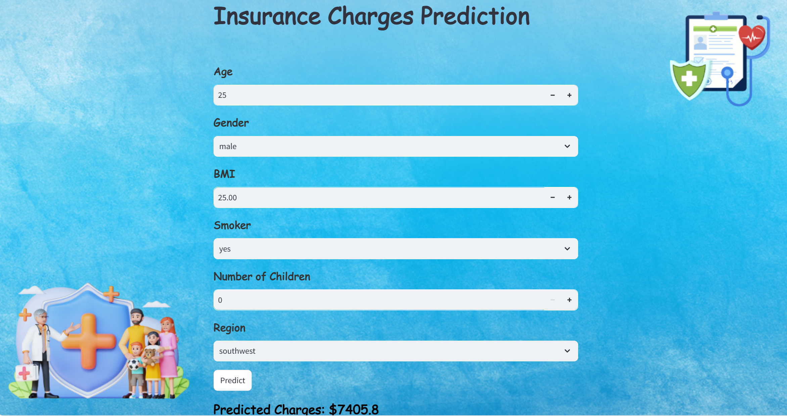

# 💻 Health Insurance Charges Prediction Using Machine Learning



## Streamlit Link
[App link](https://health-insurance-charges-prediction-v75m8mibpv77qv6jqrhoru.streamlit.app/)
## Project Overview
This project aims to predict health insurance charges based on various personal factors such as age, BMI, smoking habits,number of children and region using machine learning algorithms. The primary goal is to build a predictive model that accurately estimates the insurance premiums individuals might expect based on their health and demographic information. The project also includes a user-friendly interface built with Streamlit, allowing users to input their details and receive instant charge predictions.

## Datasets
The dataset used for this project is sourced from [Kaggle](https://www.kaggle.com/datasets/mirichoi0218/insurance). It includes the following features:
- **Age:** The age of the individual.
- **Sex:** Insurance contractor gender, female, male.
- **BMI:** Body Mass Index, which is a measure of body fat based on height and weight.
- **Children:** The number of children covered by the insurance policy.
- **Smoker:** Whether the individual is a smoker or not.
- **Region:** The residential area of the individual in the US i.e. northeast, southeast, southwest, northwest.
- **Charges:** The medical costs billed by the health insurance provider.

## Tools and Technologies Used
- **Data Analysis:** Python (Pandas,Numpy)
- **Machine Learning:** Scikit-Learn(Linear Regression, Support vector Regression, Decision Tree, Random Forest,K-Nearest Neighbors, XGBoost, Gradient Boosting) 
- **Visualization:** Matplotlib, Seaborn
- **Model Deployment:** Streamlit
- **Version Control:** Git, GitHub

## Installation and Usage
**Prerequisites**
Ensure you have Python installed on your machine. You will also need to install the required libraries:

```bash
# Install dependencies
pip install -r requirements.txt
```
**Running the Project**
```bash
# Clone the repository
git clone https://github.com/puni-ram48/Health-Insurance-Charges-Prediction.git
```
```bash
# Run the Streamlit Application
streamlit run app.py
```
**Interact with the Application:**
- Open the provided local URL in your web browser.
- Enter the required details such as age,sex, BMI, number of children, smoking status, and region.
- The application will predict the insurance charges based on the inputs provided.

[**Data**](data): Conatins the dataset for the given project.

[**Project Analysis Report**](analysis_report.ipynb): Final report containing data analysis and visualizations and the model development .

[**SVM_Model**](svm_model.pkl): Saved machine learning model for deployment.

[**app.py**](app.py): Streamlit application script.

[**requirements.txt**](requirements.txt): List of required python libraries.

## Model Development and Evaluation

1. **Data Preprocessing**:
  - Handling missing values (if any).
  - Encoding categorical variables (e.g., smoker, region).
  - Scaling numerical features for better model performance.
    
2. **Model Training**:
  - Several models including Linear Regression, Decision Trees, and Random Forest were trained.
  - Hyperparameter tuning was performed to improve model accuracy.
    
3. **Model Evaluation**:
  - The models were evaluated using metrics such as Mean Absolute Error (MAE), Mean Squared Error (MSE), RMSE and R-squared.
  - The best-performing model was selected for deployment.

## Contributing
We welcome contributions to this project! If you would like to contribute, please follow these steps:
1. Fork the repository.
2. Create a new branch (`git checkout -b feature/YourFeature`).
3. Make your changes and commit them (`git commit -am 'Add some feature'`).
4. Push to the branch (`git push origin feature/YourFeature`).
5. Create a new Pull Request.

Please ensure your code is well-documented.

## Authors and Acknowledgment
This project was initiated and completed by Puneetha Dharmapura Shrirama. Special thanks to the Jeevitha DS for the guidance and support.

## License
This project is licensed under the MIT License - see the [LICENSE](LICENSE) file for details.
